How to run terraform script using GitLab CI/CD?
===============================================


<div>


<div>


{.l .eq .bx
.dc .dd .cw width="44" height="44"}


<div>


{.l .eq .bx
.bq .hn .cw width="24" height="24"}


</div>


[]{.be .b .bf .z .bj}


<div>


[Dhruvin
Soni]{.af
.ag .ah .ai .aj .ak .al .am .an .ao .ap .aq .ar .hs}


</div>


[[·]{.be .b .bf .z .dw}]{.ht .hu aria-hidden="true"}

Follow


[]{.be .b .bf .z .dw}


[Published in]{.ih .l .ia}

<div>


{.af
.ag .ah .ai .aj .ak .al .am .an .ao .ap .aq .ar .hs .ab .q}

Geek Culture


</div>


[[·]{.be .b .bf .z .dw}]{.ht .hu aria-hidden="true"}


[]{.be .b .bf .z .dw}


[8 min read]{testid="storyReadTime"}


[[·]{.be .b .bf .z .dw}]{.l aria-hidden="true"}


[Sep 3, 2021]{testid="storyPublishDate"}


<div>

<div>

</div>


<div>


102[]{.l .h .g .f .rc .rd}


</div>


<div>


[7]{.pw-responses-count .kt .ku}


</div>


<div>


<div>

{.af
.ag .ah .ai .aj .ak .al .am .an .ao .ap .aq .ar .as .at}

<div>


Listen
</div>


<div>


Share


<div>


More


What is GitLab CI/CD?
=====================

**GitLab CI/CD** is **the part of GitLab** that you use for all of the
**continuous methods (Continuous Integration, Delivery, and
Deployment)**. With **GitLab CI/CD**, you can **test**, **build**, and
**publish** your code with no third-party application or integration
needed.

Read more about **GitLab CI/CD**
**here**{.af .oe}.

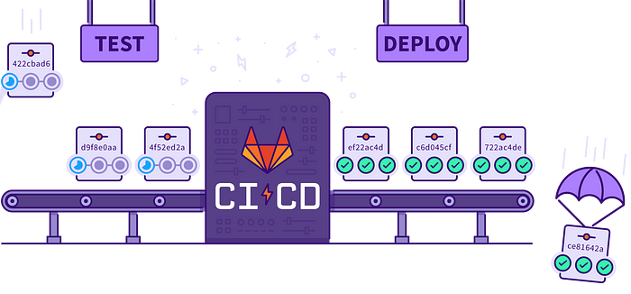{.bg .ll .os
.c width="700" height="326"}

What is Terraform?
==================

**Terraform** is an open-source **infrastructure as a code (IAC)** tool
that allows to create, manage & deploy the production-ready environment.
**Terraform** codifies cloud APIs into declarative configuration files.
**Terraform** can manage both existing service providers and custom
in-house solutions.

Read more about **Terraform** from
**here**{.af .oe}**.**

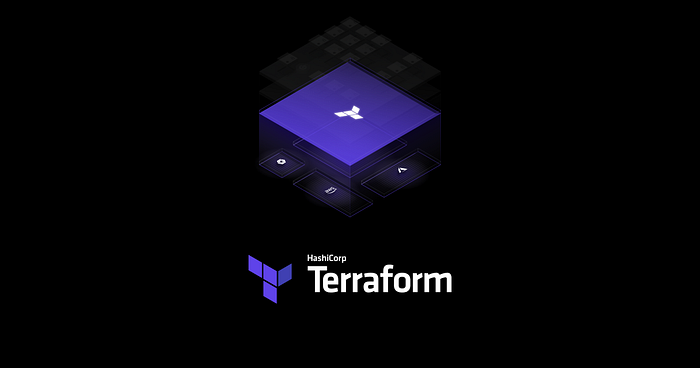{.bg .ll .os .c
width="700" height="368"}

In this lab, I have integrated **Terraform** with **GitLab CI/CD**
and created various resources on **AWS**.

{.bg
.ll .os .c width="600" height="300"}

Prerequisite:
=============

-   **AWS & GitLab Account**
-   [Basic understanding of **AWS**{.af
    .oe}, **Terraform**{.af
    .oe} **&** **GitLab CI/CD**{.af
    .oe}]
-   [An **access key** & **secret key** created in the **AWS**

Lets, start with the configuration of the project

**Step 1:-** Create a **Repository**

-   [Create a repository in your GitLab account & give it a name of your
    choice]

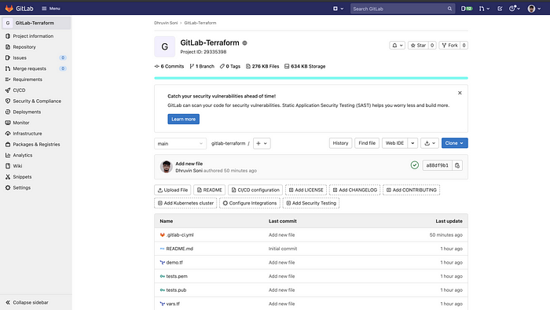{.bg .ll
.os .c width="700" height="394"}

**Step 2:-** Create a **terraform** file for resource creation

-   [Create a `.tf`{.cw .pj .pk .pl .pm .b} file inside the root
    directory and add the below code in it.]

```
# Configure and downloading plugins for aws
provider "aws" {
  region     = "${var.aws_region}"
}

# Creating VPC
resource "aws_vpc" "demovpc" {
  cidr_block       = "${var.vpc_cidr}"
  instance_tenancy = "default"

  tags = {
    Name = "Demo VPC"
  }
}

# Creating Internet Gateway 
resource "aws_internet_gateway" "demogateway" {
  vpc_id = "${aws_vpc.demovpc.id}"
}

# Grant the internet access to VPC by updating its main route table
resource "aws_route" "internet_access" {
  route_table_id         = "${aws_vpc.demovpc.main_route_table_id}"
  destination_cidr_block = "0.0.0.0/0"
  gateway_id             = "${aws_internet_gateway.demogateway.id}"
}

# Creating 1st subnet 
resource "aws_subnet" "demosubnet" {
  vpc_id                  = "${aws_vpc.demovpc.id}"
  cidr_block             = "${var.subnet_cidr}"
  map_public_ip_on_launch = true
  availability_zone = "us-east-1a"

  tags = {
    Name = "Demo subnet"
  }
}

# Creating 2nd subnet 
resource "aws_subnet" "demosubnet1" {
  vpc_id                  = "${aws_vpc.demovpc.id}"
  cidr_block             = "${var.subnet1_cidr}"
  map_public_ip_on_launch = true
  availability_zone = "us-east-1b"

  tags = {
    Name = "Demo subnet 1"
  }
}

# Creating Security Group
resource "aws_security_group" "demosg" {
  name        = "Demo Security Group"
  description = "Demo Module"
  vpc_id      = "${aws_vpc.demovpc.id}"

  # Inbound Rules
  # HTTP access from anywhere
  ingress {
    from_port   = 80
    to_port     = 80
    protocol    = "tcp"
    cidr_blocks = ["0.0.0.0/0"]
  }

  # HTTPS access from anywhere
  ingress {
    from_port   = 443
    to_port     = 443
    protocol    = "tcp"
    cidr_blocks = ["0.0.0.0/0"]
  }

  # SSH access from anywhere
  ingress {
    from_port   = 22
    to_port     = 22
    protocol    = "tcp"
    cidr_blocks = ["0.0.0.0/0"]
  }

  # Splunk default port
  ingress {
    from_port   = 8000
    to_port     = 8000
    protocol    = "tcp"
    cidr_blocks = ["0.0.0.0/0"]
  }
  
  # Replication Port
  ingress {
    from_port   = 8089
    to_port     = 8089
    protocol    = "tcp"
    cidr_blocks = ["0.0.0.0/0"]
  }

  # Management Port
  ingress {
    from_port   = 4598
    to_port     = 4598
    protocol    = "tcp"
    cidr_blocks = ["0.0.0.0/0"]
  }

  # Ingestion Port
  ingress {
    from_port   = 9997
    to_port     = 9997
    protocol    = "tcp"
    cidr_blocks = ["0.0.0.0/0"]
  }

  # Outbound Rules
  # Internet access to anywhere
  egress {
    from_port   = 0
    to_port     = 0
    protocol    = "-1"
    cidr_blocks = ["0.0.0.0/0"]
  }
}

# Creating key pair
resource "aws_key_pair" "demokey" {
  key_name   = "${var.key_name}"
  public_key = "${file(var.public_key)}"
}
  
# Creating EC2 Instance
resource "aws_instance" "demoinstance" {

  # AMI based on region 
  ami = "${lookup(var.ami, var.aws_region)}"

  # Launching instance into subnet 
  subnet_id = "${aws_subnet.demosubnet.id}"

  # Instance type 
  instance_type = "${var.instancetype}"
  
  # Count of instance
  count= "${var.master_count}"
  
  # SSH key that we have generated above for connection
  key_name = "${aws_key_pair.demokey.id}"

  # Attaching security group to our instance
  vpc_security_group_ids = ["${aws_security_group.demosg.id}"]

  # Attaching Tag to Instance 
  tags = {
    Name = "Search-Head-${count.index + 1}"
  }
  
  # Root Block Storage
  root_block_device {
    volume_size = "40"
    volume_type = "standard"
  }
  
  #EBS Block Storage
  ebs_block_device {
    device_name = "/dev/sdb"
    volume_size = "80"
    volume_type = "standard"
    delete_on_termination = false
  }
  
  # SSH into instance 
  connection {
    
    # Host name
    host = self.public_ip
    # The default username for our AMI
    user = "ec2-user"
    # Private key for connection
    private_key = "${file(var.private_key)}"
    # Type of connection
    type = "ssh"
  }
  
  # Installing splunk on newly created instance
  provisioner "remote-exec" {
    inline = [
      "sudo yum update -y",
      "sudo amazon-linux-extras install docker -y",
      "sudo service docker start",
      "sudo usermod -a -G docker ec2-user",
      "sudo chkconfig docker on",
      "sudo yum install -y git",
      "sudo chmod 666 /var/run/docker.sock",
      "docker pull dhruvin30/dhsoniweb:v1",
      "docker run -d -p 80:80 dhruvin30/dhsoniweb:latest"   
  ]
 }
}
```

**Step 3:-** Create **terraform** file for variables

-   [In the resource creation file, I have used multiple variables so
    that we need to create a variable file that contains the definition
    of the variables]
-   [Create a `vars.tf`{.cw .pj .pk .pl .pm .b} file in the root
    directory and add the below code to it]
-   [The below code will create various resources on AWS. If you can't
    understand anything in the code you can have a better understanding
    from
    **here**{.af
    .oe}]

```
# Defining Public Key
variable "public_key" {
  default = "tests.pub"
}

# Defining Private Key
variable "private_key" {
  default = "tests.pem"
}

# Definign Key Name for connection
variable "key_name" {
  default = "tests"
  description = "Desired name of AWS key pair"
}

# Defining Region
variable "aws_region" {
  default = "us-east-1"
}

# Defining CIDR Block for VPC
variable "vpc_cidr" {
  default = "10.0.0.0/16"
}

# Defining CIDR Block for Subnet
variable "subnet_cidr" {
  default = "10.0.1.0/24"
}

# Defining CIDR Block for 2d Subnet
variable "subnet1_cidr" {
  default = "10.0.2.0/24"
}

# Defining AMI
variable "ami" {
  default = {
    eu-west-1 = "ami-0ea3405d2d2522162"
    us-east-1 = "ami-09d95fab7fff3776c"
  }
}

# Defining Instace Type
variable "instancetype" {
  default = "t2.medium"
}

# Defining Master count 
variable "master_count" {
  default = 1
}
```

**Step 4:-** Store the **AWS** **keys**

-   [In order to create the resources in the AWS account, we must need
    to have the **AWS Access Key** & **AWS Secret Key**
-   [Now, we need to store the **AWS Access Key** & **AWS Secret Key**
    in the secrets section of the repository]
-   [Go to **settings** -\> **CI/CD** -\> Under the variable section
    create the below variables and store your **AWS access keys** &
    **AWS secret keys**

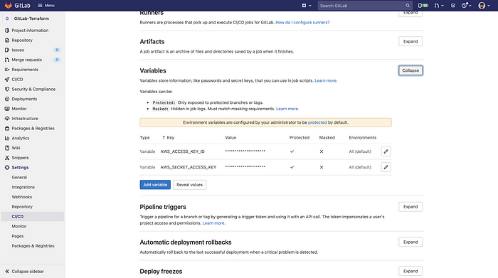{.bg
.ll .os .c width="700" height="391"}

**Step 4:-** Create a **workflow** file

-   [Now in order to create the terraform resources automatically, we
    need to create a workflow file]
-   [Create `.gitlab-ci.yml`{.cw .pj .pk .pl .pm .b} file and add the
    below code to it]
-   [The below job will run on every **push** and **pull request** that
    happens on the master branch. In the build section, I have specified
    the image name and commands in the script section.]

```
stages:
  - validate
  - plan
  - applyimage:
  name: hashicorp/terraform:light
  entrypoint:
    - '/usr/bin/env'
    - 'PATH=/usr/local/sbin:/usr/local/bin:/usr/sbin:/usr/bin:/sbin:/bin'before_script:
  - export AWS_ACCESS_KEY=${AWS_ACCESS_KEY_ID}
  - export AWS_SECRET_ACCESS_KEY=${AWS_SECRET_ACCESS_KEY}
  - rm -rf .terraform
  - terraform --version
  - terraform initvalidate:
  stage: validate
  script:
    - terraform validateplan:
  stage: plan
  script:
    - terraform plan -out "planfile"
  dependencies:
    - validate
  artifacts:
    paths:
      - planfileapply:
  stage: apply
  script:
    - terraform apply -input=false "planfile"
  dependencies:
    - plan
  when: manual
```

Let's understand the above code.

-   [The below code is to declare the name of stages]

```
stages:
  - validate
  - plan
  - apply
```

-   [We are using `terraform`{.cw .pj .pk .pl .pm .b} image to run the
    Terraform scripts and setting the `entrypoint`{.cw .pj .pk .pl .pm
    .b} of Terraform path]

```
image:
  name: hashicorp/terraform:light
  entrypoint:
    - '/usr/bin/env'
    - 'PATH=/usr/local/sbin:/usr/local/bin:/usr/sbin:/usr/bin:/sbin:/bin'
```

-   [In the `before_script`{.cw .pj .pk .pl .pm .b} section we are
    exporting the AWS access key & secret key, checking the version of
    terraform, doing some cleanup stuff, and also initialize the working
    directory by running `terraform init`{.cw .pj .pk .pl .pm
    .b}]

```
before_script:
  - export AWS_ACCESS_KEY=${AWS_ACCESS_KEY_ID}
  - export AWS_SECRET_ACCESS_KEY=${AWS_SECRET_ACCESS_KEY}
  - rm -rf .terraform
  - terraform --version
  - terraform init
```

-   [In the `validate`{.cw .pj .pk .pl .pm .b} section we are validating
    the terraform script]

```
validate:
  stage: validate
  script:
    - terraform validate
```

-   [In the `plan`{.cw .pj .pk .pl .pm .b} section we are generating the
    terraform plan and store in the artifact so that we can use it in
    the next stage]

```
plan:
  stage: plan
  script:
    - terraform plan -out "planfile"
  dependencies:
    - validate
  artifacts:
    paths:
      - planfile
```

-   [In the `apply`{.cw .pj .pk .pl .pm .b} section we are running
    `terraform apply`{.cw .pj .pk .pl .pm .b} so that terraform can
    create resources on AWS]
-   `dependencies`{.cw .pj .pk .pl .pm .b} will make sure that
    `apply`{.cw .pj .pk .pl .pm .b} stage will only run if `plan`{.cw
    .pj .pk .pl .pm .b} stage goes successful]
-   `when: manual`{.cw .pj .pk .pl .pm .b} will ensure that we manually
    need to trigger this stage]

```
apply:
  stage: apply
  script:
    - terraform apply -input=false "planfile"
  dependencies:
    - plan
  when: manual
```

**Step 5:-** Check the **output**

-   [Now, As soon as you commit your workflow file GitLab will trigger
    the action and the resources will be going to create on the AWS
    account.]

> The `validate`{.cw .pj .pk .pl .pm .b} and `plan`{.cw .pj .pk .pl .pm
> .b} job will run automatically but you need to manually trigger the
> `apply`{.cw .pj .pk .pl .pm .b} job

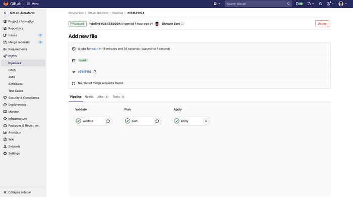{.bg .ll .os
.c width="700" height="390"}

-   [After running the job you will see that all the steps run perfectly
    and there was no error. So you will have `passed`{.cw .pj .pk .pl
    .pm .b}written in the green color as each step job
    successfully.]

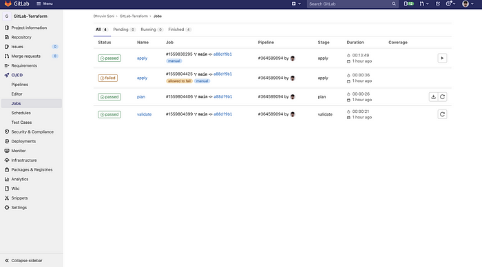{.bg .ll .os .c
width="700" height="389"}

-   [You can also check the output of each step by clicking on
    it]

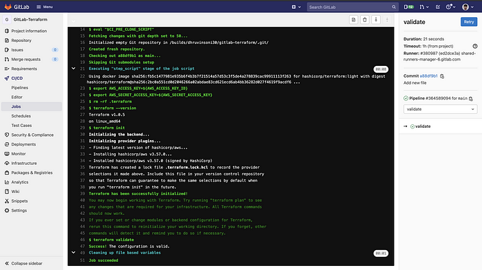{.bg .ll
.os .c width="700" height="393"}

**Step 6:-** Check the resources on **AWS**

-   [As soon as the job finishes to run you can navigate to AWS and
    check all the resources]
-   [Terraform will create below resources]

1.  **VPC**

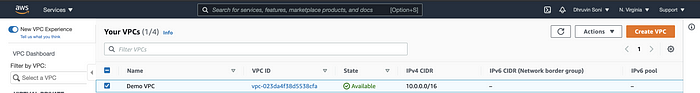{.bg .ll .os .c
width="700" height="93"}

**2. Subnets**

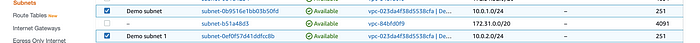{.bg .ll .os .c
width="700" height="43"}

**3. Internet Gateway**

{.bg .ll
.os .c width="700" height="90"}

**4. Rouet Table**

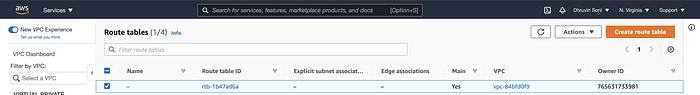{.bg .ll .os
.c width="700" height="95"}

**5. Security Group**

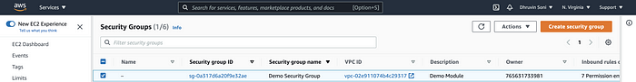{.bg .ll
.os .c width="700" height="92"}

**6. Key Pair**

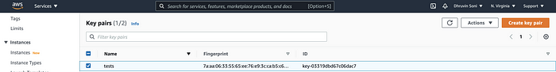{.bg .ll .os .c
width="700" height="91"}

**7. EC2 Instance**

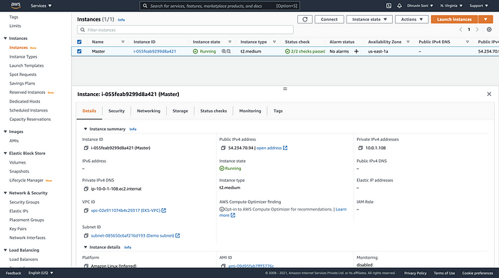{.bg .ll .os
.c width="700" height="391"}

**Step 7:-** Verify the **output**

-   [In the Terraform configuration code, we have used Remote
    Provisioner to install docker and also ran the docker image on
    it]
-   [In order to check the output navigate to
    **\<public-ip:80\>**
-   [You should see an output like below]

{.bg .ll .os .c
width="700" height="390"}

That's it now, you have learned how to integrate Terraform with GitLab
CI/CD. You can now play with it and modify it accordingly.

