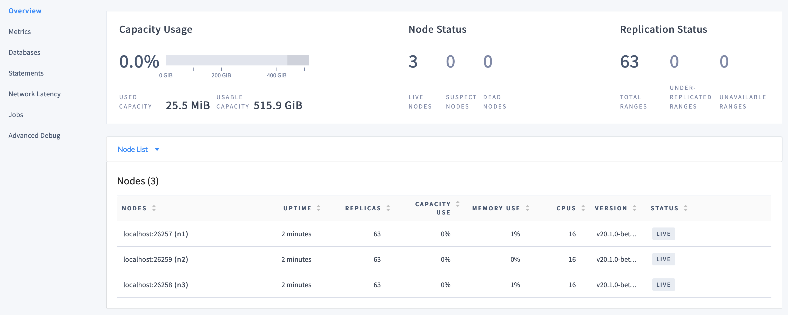

# Lab 7: Deploy a Local Cluster from Binary (Insecure)


- Step 1. Start the cluster
- Step 2. Use the built-in SQL client
- Step 3. Access the DB Console
- Step 4. Simulate node maintenance
- Step 5. Stop the cluster


Once you\'ve installed CockroachDB, it\'s simple to run an insecure multi-node cluster locally.


The store directory is `cockroach-data/` in the same directory as the
`cockroach` command by default, or the location passed to the `--store`
flag otherwise.

## Step 1. Start the cluster

This section shows how to start a cluster interactively.


1.  Use the
    `cockroach start`
    command to start `node1` in the foreground:

    
    ```
    cockroach start \
    --insecure \
    --store=node1 \
    --listen-addr=localhost:26257 \
    --http-addr=localhost:8080 \
    --join=localhost:26257,localhost:26258,localhost:26259
    ```
    

    Note:

    The `--background` flag is not recommended. If you decide to start
    nodes in the background, you must also pass the `--pid-file`
    argument. To stop a `cockroach` process running in the background,
    extract the process ID from the PID file and pass it to the command
    to stop the node.


    You\'ll see a message like the following:

    
    ```
    *
    * WARNING: RUNNING IN INSECURE MODE!
    *
    * - Your cluster is open for any client that can access localhost.
    * - Any user, even root, can log in without providing a password.
    * - Any user, connecting as root, can read or write any data in your cluster.
    * - There is no network encryption nor authentication, and thus no confidentiality.
    *
    *
    *
    * INFO: initial startup completed.
    * Node will now attempt to join a running cluster, or wait for `cockroach init`.
    * Client connections will be accepted after this completes successfully.
    * Check the log file(s) for progress.
    *
    ```
    

2.  Take a moment to understand the
    [flags]
    you used:

    -   The `--insecure` flag makes communication unencrypted.

    -   Since this is a purely local cluster,
        `--listen-addr=localhost:26257` and `--http-addr=localhost:8080`
        tell the node to listen only on `localhost`, with port `26257`
        used for internal and client traffic and port `8080` used for
        HTTP requests from the DB Console.

    -   The `--store` flag indicates the location where the node\'s data
        and logs are stored.

    -   The `--join` flag specifies the addresses and ports of the nodes
        that will initially comprise your cluster. You\'ll use this
        exact `--join` flag when starting other nodes as well.

        For a cluster in a single region, set 3-5 `--join` addresses.
        Each starting node will attempt to contact one of the join
        hosts. In case a join host cannot be reached, the node will try
        another address on the list until it can join the gossip
        network.

3.  In new terminal windows, start `node2` and `node3`:

    
    ```
    cockroach start \
    --insecure \
    --store=node2 \
    --listen-addr=localhost:26258 \
    --http-addr=localhost:8081 \
    --join=localhost:26257,localhost:26258,localhost:26259
    ```
    

    
    ```
    cockroach start \
    --insecure \
    --store=node3 \
    --listen-addr=localhost:26259 \
    --http-addr=localhost:8082 \
    --join=localhost:26257,localhost:26258,localhost:26259
    ```
    

    These commands are the same as before but with unique `--store`,
    `--listen-addr`, and `--http-addr` flags.

4.  Use the
    `cockroach init`
    command to perform a one-time initialization of the cluster, sending
    the request to any node on the `--join` list:

    
    ```
    cockroach init --insecure --host=localhost:26257
    ```
    

    You\'ll see the following message:

    
    ```
    Cluster successfully initialized
    ```
    

    At this point, each node also prints helpful startup
    details to its log, and to `STDOUT` in the terminal window where the node
    was started. For example, the following command retrieves `node1`\'s
    startup details:

    
    ```
    grep 'node starting' node1/logs/cockroach.log -A 11
    ```
    

    The output will look something like this:

    
    ```
    CockroachDB node starting at 
    build:               CCL v23.1.13 @ 2023-12-11 00:00:00 (go1.12.6)
    webui:               http://localhost:8080
    sql:                 postgresql://root@localhost:26257?sslmode=disable
    RPC client flags:    cockroach <client cmd> --host=localhost:26257 --insecure
    logs:                /Users/<username>/node1/logs
    temp dir:            /Users/<username>/node1/cockroach-temp242232154
    external I/O path:   /Users/<username>/node1/extern
    store[0]:            path=/Users/<username>/node1
    status:              initialized new cluster
    clusterID:           8a681a16-9623-4fc1-a537-77e9255daafd
    nodeID:              1
    ```
    

## Step 2. Use the built-in SQL client

Now that your cluster is live, you can use any node as a SQL gateway. To
test this out, let\'s use CockroachDB\'s built-in SQL client.

1.  In a new terminal, run the [cockroach
    sql] command
    and connect to `node1`:

    
    ```
    cockroach sql --insecure --host=localhost:26257
    ```
    

    To exit the SQL shell at any time, you can use the `\q` command:

    
    ```
    \q
    ```
    

2.  Run some basic [CockroachDB SQL
    statements]:

    
    ```
    CREATE DATABASE bank;
    ```
    

    
    ```
    CREATE TABLE bank.accounts (id INT PRIMARY KEY, balance DECIMAL);
    ```
    

    
    ```
    INSERT INTO bank.accounts VALUES (1, 1000.50);
    ```
    

    
    ```
    SELECT * FROM bank.accounts;
    ```
    

    
    ```
      id | balance
    +----+---------+
       1 | 1000.50
    (1 row)
    ```
    

3.  In a new terminal window, open a new SQL shell and connect to
    `node2`:

    
    ```
    cockroach sql --insecure --host=localhost:26258
    ```
    

    
    
    Note:
    

    In a real deployment, all nodes would likely use the default port
    `26257`, and so you wouldn\'t need to set the port portion of
    `--host`.
    

4.  Run the same `SELECT` query as before:

    
    ```
    SELECT * FROM bank.accounts;
    ```
    

    
    ```
      id | balance
    +----+---------+
       1 | 1000.50
    (1 row)
    ```
    

    As you can see, node 1 and node 2 behaved identically as SQL
    gateways.

5.  Exit all SQL shell sessions by issuing the `\q` command in the
    terminals where they are running:

    
    ```
    \q
    ```
        

## Step 3. Access the DB Console

The CockroachDB [DB
Console] gives you
insight into the overall health of your cluster as well as the
performance of the client workload.

1.  Go to [http://localhost:8080](http://localhost:8080/) in **Google Chrome**.

    

2.  On the **Cluster Overview**,
    notice that three nodes are live, with an identical replica count on
    each node:

    

    This demonstrates CockroachDB\'s automated replication of data via the Raft consensus protocol.

    
    

3.  Click
    **Metrics**
    to access a variety of time series dashboards, including graphs of
    SQL queries and service latency over time:

    

4.  Use the **Databases**, **Statements**, and **Jobs**
    pages to view details about your databases and tables, to assess the
    performance of specific queries, and to monitor the status of
    long-running operations like schema changes, respectively.

## Step 4. Simulate node maintenance

1.  In a new terminal, gracefully shut down a node. This is normally
    done prior to node maintenance:

    Get the process IDs of the nodes:

    
    ```
    ps -ef | grep cockroach | grep -v grep
    ```
    

    
    ```
      501  4482     1   0  2:41PM ttys000    0:09.78 cockroach start --insecure --store=node1 --listen-addr=localhost:26257 --http-addr=localhost:8080 --join=localhost:26257,localhost:26258,localhost:26259
      501  4497     1   0  2:41PM ttys000    0:08.54 cockroach start --insecure --store=node2 --listen-addr=localhost:26258 --http-addr=localhost:8081 --join=localhost:26257,localhost:26258,localhost:26259
      501  4503     1   0  2:41PM ttys000    0:08.54 cockroach start --insecure --store=node3 --listen-addr=localhost:26259 --http-addr=localhost:8082 --join=localhost:26257,localhost:26258,localhost:26259
    ```
    

    Gracefully shut down `node3`, specifying its process ID:

    
    ```
    kill -TERM UPDATE_HERE
    ```
    

2.  In the DB Console, despite one node being \"suspect\", notice the
    continued SQL traffic:

    

3.  Go to the terminal window for `node3` and restart it:

    
    ```
    cockroach start \
    --insecure \
    --store=node3 \
    --listen-addr=localhost:26259 \
    --http-addr=localhost:8082 \
    --join=localhost:26257,localhost:26258,localhost:26259
    ```
    

## Step 5. Stop the cluster

1.  When you\'re done with your test cluster, stop the nodes.

    Get the process IDs of the nodes:

    
    ```
    ps -ef | grep cockroach | grep -v grep
    ```
    

    
    ```
      501  4482     1   0  2:41PM ttys000    0:09.78 cockroach start --insecure --store=node1 --listen-addr=localhost:26257 --http-addr=localhost:8080 --join=localhost:26257,localhost:26258,localhost:26259
      501  4497     1   0  2:41PM ttys000    0:08.54 cockroach start --insecure --store=node2 --listen-addr=localhost:26258 --http-addr=localhost:8081 --join=localhost:26257,localhost:26258,localhost:26259
      501  4503     1   0  2:41PM ttys000    0:08.54 cockroach start --insecure --store=node3 --listen-addr=localhost:26259 --http-addr=localhost:8082 --join=localhost:26257,localhost:26258,localhost:26259
    ```
    

    Gracefully shut down each node by sending the `SIGTERM` signal to
    the `cockroach` process:

    
    ```
    kill -TERM UPDATE_HERE
    ```
    

    **Important:** Repeat this command for each node.
    

3.  You can remove the nodes\' data stores:

    
    ```
    rm -rf node1 node2 node3
    ```
   