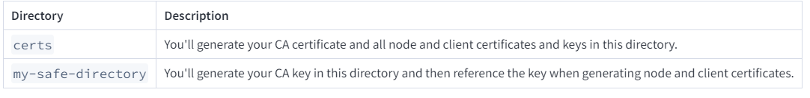
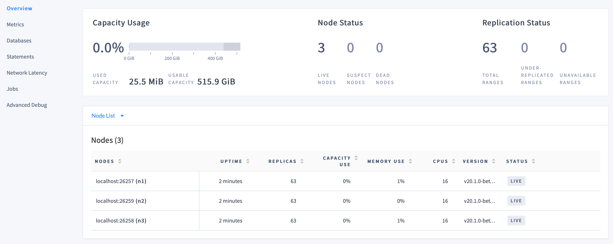
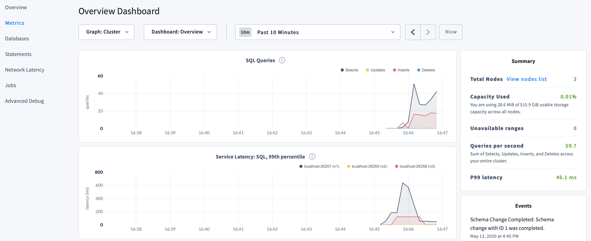
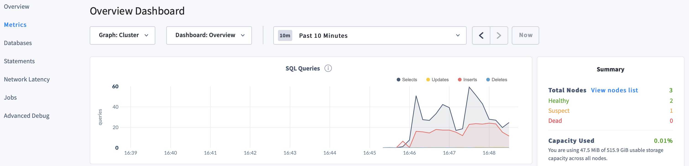

# Lab 8: Securing your CockroachDB instance

- Step 1. Generate certificates
- Step 2. Start the cluster
- Step 3. Use the built-in SQL client
- Step 4. Access the DB Console
- Step 5. Simulate node maintenance
- Step 6. Stop the cluster


## Before you begin

Make sure you have already installed CockroachDB.


Once you\'ve installed CockroachDB,
it\'s simple to run a secure multi-node cluster locally, using [TLS
certificates to encrypt network communication.


## Step 1. Generate certificates

You can use either
`cockroach cert` commands to generate security certificates. This section features the `cockroach cert` commands.

1.  Create two directories:

    
    ```
    mkdir certs my-safe-directory
    ```
    

    


2.  Create the CA (Certificate Authority) certificate and key pair:

    
    ```
    cockroach cert create-ca \
    --certs-dir=certs \
    --ca-key=my-safe-directory/ca.key
    ```
    

3.  Create the certificate and key pair for your nodes:

    
    ```
    cockroach cert create-node \
    localhost \
    $(hostname) \
    --certs-dir=certs \
    --ca-key=my-safe-directory/ca.key
    ```
    

    Because you\'re running a local cluster and all nodes use the same
    hostname (`localhost`), you only need a single node certificate.
    Note that this is different than running a production cluster, where
    you would need to generate a certificate and key for each node,
    issued to all common names and IP addresses you might use to refer
    to the node as well as to any load balancer instances.

4.  Create a client certificate and key pair for the `root` user:

    
    ```
    cockroach cert create-client \
    root \
    --certs-dir=certs \
    --ca-key=my-safe-directory/ca.key
    ```
    

## Step 2. Start the cluster

1.  Use the
    `cockroach start`
    command to start the first node:

    
    ```
    cockroach start \
    --certs-dir=certs \
    --store=node1 \
    --listen-addr=localhost:26257 \
    --http-addr=localhost:8080 \
    --join=localhost:26257,localhost:26258,localhost:26259
    ```
    

    You\'ll see a message like the following:

    
    ```
    *
    * INFO: initial startup completed.
    * Node will now attempt to join a running cluster, or wait for `cockroach init`.
    * Client connections will be accepted after this completes successfully.
    * Check the log file(s) for progress.
    *
    ```
    

2.  Take a moment to understand the
    [flags]
    you used:

    -   The `--certs-dir` directory points to the directory holding
        certificates and keys.

    -   Since this is a purely local cluster,
        `--listen-addr=localhost:26257` and `--http-addr=localhost:8080`
        tell the node to listen only on `localhost`, with port `26257`
        used for internal and client traffic and port `8080` used for
        HTTP requests from the DB Console.

    -   The `--store` flag indicates the location where the node\'s data
        and logs are stored.

    -   The `--join` flag specifies the addresses and ports of the nodes
        that will initially comprise your cluster. You\'ll use this
        exact `--join` flag when starting other nodes as well.

        For a cluster in a single region, set 3-5 `--join` addresses.
        Each starting node will attempt to contact one of the join
        hosts. In case a join host cannot be reached, the node will try
        another address on the list until it can join the gossip
        network.

3.  In separate terminal windows, start two more nodes:

    
    ```
    cockroach start \
    --certs-dir=certs \
    --store=node2 \
    --listen-addr=localhost:26258 \
    --http-addr=localhost:8081 \
    --join=localhost:26257,localhost:26258,localhost:26259
    ```
    

    
    ```
    cockroach start \
    --certs-dir=certs \
    --store=node3 \
    --listen-addr=localhost:26259 \
    --http-addr=localhost:8082 \
    --join=localhost:26257,localhost:26258,localhost:26259
    ```
    

    These commands are the same as before but with unique `--store`,
    `--listen-addr`, and `--http-addr` flags.

4.  Use the
    `cockroach init`
    command to perform a one-time initialization of the cluster, sending
    the request to any node on the `--join` list:

    
    ```
    cockroach init --certs-dir=certs --host=localhost:26257
    ```
    

    You\'ll see the following message:

    
    ```
    Cluster successfully initialized
    ```
    

    At this point, each node also prints helpful [startup
    details]
    to its log. For example, the following command retrieves node 1\'s
    startup details:

    
    ```
    grep 'node starting' node1/logs/cockroach.log -A 11
    ```
    

    The output will look something like this:

    
    ```
    CockroachDB node starting at 
    build:               CCL v23.1.13 @ 2023-12-11 00:00:00 (go1.12.6)
    webui:               https://localhost:8080
    sql:                 postgresql://root@localhost:26257?sslcert=certs%2Fclient.root.crt&sslkey=certs%2Fclient.root.key&sslmode=verify-full&sslrootcert=certs%2Fca.crt
    RPC client flags:    cockroach <client cmd> --host=localhost:26257 --certs-dir=certs
    logs:                /Users/<username>/node1/logs
    temp dir:            /Users/<username>/node1/cockroach-temp966687937
    external I/O path:   /Users/<username>/node1/extern
    store[0]:            path=/Users/<username>/node1
    status:              initialized new cluster
    clusterID:           b2537de3-166f-42c4-aae1-742e094b8349
    nodeID:              1
    ```
    

## Step 3. Use the built-in SQL client

Now that your cluster is live, you can use any node as a SQL gateway. To
test this out, let\'s use CockroachDB\'s built-in SQL client.

1.  Run the
    `cockroach sql`
    command against node 1:

    
    ```
    cockroach sql --certs-dir=certs --host=localhost:26257
    ```
    

2.  Run some basic [CockroachDB SQL
    statements]:

    
    ```
    CREATE DATABASE bank;
    ```
    

    
    ```
    CREATE TABLE bank.accounts (id INT PRIMARY KEY, balance DECIMAL);
    ```
    

    
    ```
    INSERT INTO bank.accounts VALUES (1, 1000.50);
    ```
    

    
    ```
    SELECT * FROM bank.accounts;
    ```
    

    
    ```
      id | balance
    +----+---------+
       1 | 1000.50
    (1 row)
    ```
    

3.  Now exit the SQL shell on node 1 and open a new shell on node 2:

    
    ```
    \q
    ```
    

    
    ```
    cockroach sql --certs-dir=certs --host=localhost:26258
    ```
    

    
    
    Note:
    

    In a real deployment, all nodes would likely use the default port
    `26257`, and so you wouldn\'t need to set the port portion of
    `--host`.
    

4.  Run the same `SELECT` query as before:

    
    ```
    SELECT * FROM bank.accounts;
    ```
    

    
    ```
      id | balance
    +----+---------+
       1 | 1000.50
    (1 row)
    ```
    

    As you can see, node 1 and node 2 behaved identically as SQL
    gateways.

5.  Now [create a user with a
    password],
    which you will need to [access the DB
    Console]:

    
    ```
    CREATE USER max WITH PASSWORD 'roach';
    ```
    

6.  Exit the SQL shell on node 2:

    
    ```
    \q
    ```
    

## Step 4. Access the DB Console

The CockroachDB [DB
Console] gives you
insight into the overall health of your cluster as well as the
performance of the client workload.

1.  On secure clusters, [certain pages of the DB
    Console]
    can only be accessed by `admin` users.

    Run the
    `cockroach sql`
    command against node 1:

    
    ```
    cockroach sql --certs-dir=certs --host=localhost:26257
    ```
    

2.  Assign `max` to the `admin` role (you only need to do this once):

    
    ```
    GRANT admin TO max;
    ```
    

3.  Exit the SQL shell:

    
    ```
    \q
    ```
    

4.  Go to
    [https://localhost:8080].
    Note that your browser will consider the CockroachDB-created
    certificate invalid; you\'ll need to click through a warning message
    to get to the UI.

    
    
    Note:
    

    If you are using Google Chrome, and you are getting an error about
    not being able to reach `localhost` because its certificate has been
    revoked, go to
    [chrome://flags/#allow-insecure-localhost](chrome://flags/#allow-insecure-localhost),
    enable \"Allow invalid certificates for resources loaded from
    localhost\", and then restart the browser. Enabling this Chrome
    feature degrades security for all sites running on `localhost`, not
    just CockroachDB\'s DB Console, so be sure to enable the feature
    only temporarily.
    

5.  Log in with the username and password you created earlier
    (`max`/`roach`).

6.  On the **Cluster Overview**,
    notice that three nodes are live, with an identical replica count on
    each node:

    

    This demonstrates CockroachDB\'s automated
    replication of data via the Raft consensus protocol.

    
    
    Note:

    Capacity metrics can be incorrect when running multiple nodes on a
    single machine.

7.  Click
    **Metrics**
    to access a variety of time series dashboards, including graphs of
    SQL queries and service latency over time:

    

8.  Use the **Databases**, **Statements** and **Jobs**
    pages to view details about your databases and tables, to assess the
    performance of specific queries, and to monitor the status of
    long-running operations like schema changes, respectively.


## Step 5. Simulate node maintenance

1.  In a new terminal, gracefully shut down a node. This is normally
    done prior to node maintenance:

    Get the process IDs of the nodes:

    
    ```
    ps -ef | grep cockroach | grep -v grep
    ```
    

    
    ```
      501  4482     1   0  2:41PM ttys000    0:09.78 cockroach start --certs-dir=certs --store=node1 --listen-addr=localhost:26257 --http-addr=localhost:8080 --join=localhost:26257,localhost:26258,localhost:26259
      501  4497     1   0  2:41PM ttys000    0:08.54 cockroach start --certs-dir=certs --store=node2 --listen-addr=localhost:26258 --http-addr=localhost:8081 --join=localhost:26257,localhost:26258,localhost:26259
      501  4503     1   0  2:41PM ttys000    0:08.54 cockroach start --certs-dir=certs --store=node3 --listen-addr=localhost:26259 --http-addr=localhost:8082 --join=localhost:26257,localhost:26258,localhost:26259
    ```
    

    Gracefully shut down node 3, specifying its process ID:

    
    ```
    kill -TERM UPDATE_HERE
    ```
    

2.  Back in the DB Console, despite one node being \"suspect\", notice
    the continued SQL traffic:

    

3.  Restart node 3:

    
    ```
    cockroach start \
    --certs-dir=certs \
    --store=node3 \
    --listen-addr=localhost:26259 \
    --http-addr=localhost:8082 \
    --join=localhost:26257,localhost:26258,localhost:26259
    ```
    

## Step 6. Stop the cluster

1.  When you\'re done with your test cluster, stop the nodes.

    Get the process IDs of the nodes:

    
    ```
    ps -ef | grep cockroach | grep -v grep
    ```
    

    
    ```
      501  4482     1   0  2:41PM ttys000    0:09.78 cockroach start --certs-dir=certs --store=node1 --listen-addr=localhost:26257 --http-addr=localhost:8080 --join=localhost:26257,localhost:26258,localhost:26259
      501  4497     1   0  2:41PM ttys000    0:08.54 cockroach start --certs-dir=certs --store=node2 --listen-addr=localhost:26258 --http-addr=localhost:8081 --join=localhost:26257,localhost:26258,localhost:26259
      501  4503     1   0  2:41PM ttys000    0:08.54 cockroach start --certs-dir=certs --store=node3 --listen-addr=localhost:26259 --http-addr=localhost:8082 --join=localhost:26257,localhost:26258,localhost:26259
    ```
    

    Gracefully shut down each node, specifying its process ID:

    
    ```
    kill -TERM UPDATE_PROCESSID_NODE1
    ```
    

    
    ```
    kill -TERM UPDATE_PROCESSID_NODE2
    ```
    

    
    ```
    kill -TERM UPDATE_PROCESSID_NODE3
    ```
    

2.  If you do not plan to restart the cluster, you may want to remove
    the nodes\' data stores and the certificate directories:

    
    ```
    rm -rf node1 node2 node3 certs my-safe-directory
    ```
   